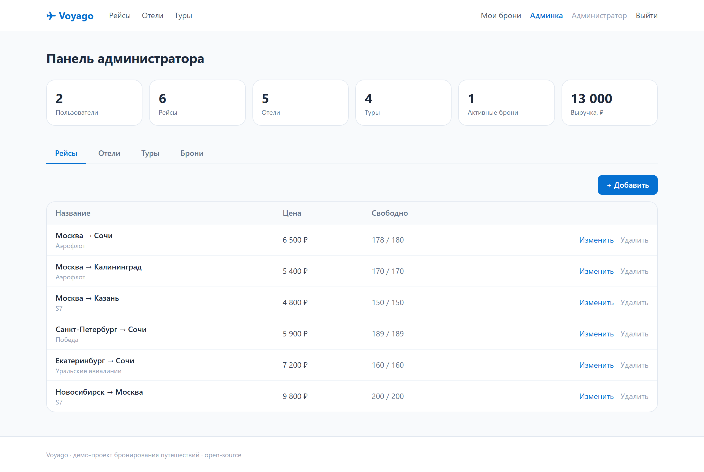

# ✈ Voyago — бронирование путешествий

Учебно-демонстрационная платформа бронирования отдыха: **авиабилеты, отели и туры**.
Есть и **пользовательская** часть (поиск, бронирование, «Мои брони», авторизация),
и **административная** (дашборд, управление предложениями, все брони, статистика).

Проект с открытым кодом — можно клонировать, запустить локально и посмотреть,
как устроено небольшое, но полноценное full-stack-приложение с JWT-авторизацией,
ролями и честной бизнес-логикой мест/номеров.


## Возможности

**Для пользователя**
- Поиск по рейсам (откуда/куда), отелям и турам (по городу)
- Каталог с карточками, ценами и остатком мест
- Бронирование с выбором количества и подсчётом суммы
- Личный кабинет «Мои брони» с отменой (места возвращаются в продажу)
- Регистрация и вход по email + паролю (JWT)

**Для администратора**
- Дашборд со сводкой: пользователи, предложения, активные брони, выручка
- CRUD рейсов, отелей и туров (создание, редактирование, удаление)
- Таблица всех бронирований платформы
- Доступ к админке защищён ролью `admin`

| Каталог | Админка |
|---|---|
|  |  |

## Технологии

**Backend** — Python
- [FastAPI](https://fastapi.tiangolo.com/) — REST API
- [SQLModel](https://sqlmodel.tiangolo.com/) (SQLAlchemy + Pydantic) поверх SQLite
- JWT-авторизация (`python-jose`), хеширование паролей `bcrypt` (`passlib`)
- Тесты: `pytest` (18 тестов, изолированная in-memory БД)

**Frontend** — TypeScript
- [React 18](https://react.dev/) + [Vite](https://vitejs.dev/)
- [React Router 6](https://reactrouter.com/), Context API для авторизации
- [Tailwind CSS](https://tailwindcss.com/)
- Тесты: [Vitest](https://vitest.dev/) + Testing Library (12 тестов)

**CI** — GitHub Actions: прогон backend- и frontend-тестов + сборка на каждый push/PR.

## Архитектура

```
voyago/
├── backend/                 # FastAPI + SQLModel
│   ├── app/
│   │   ├── main.py          # приложение, CORS, старт БД и сидов
│   │   ├── db.py            # движок SQLite, сессии
│   │   ├── models.py        # таблицы: User, Flight, Hotel, Tour, Booking
│   │   ├── schemas.py       # DTO запросов/ответов
│   │   ├── auth.py          # JWT, хеширование, зависимости current_user / require_admin
│   │   ├── seed.py          # демо-данные при пустой БД
│   │   └── routers/         # auth, catalog, bookings, admin
│   └── tests/               # pytest
└── frontend/                # React + Vite + Tailwind
    ├── src/
    │   ├── api.ts           # типизированный клиент REST
    │   ├── auth.tsx         # AuthProvider / useAuth
    │   ├── App.tsx          # роутинг, навбар, защита маршрутов
    │   └── pages/           # Home, Catalog, MyBookings, AuthPage, Admin
    └── ...
```

Бизнес-логика мест: бронирование уменьшает остаток (`seats_left` / `rooms_left` /
`spots_left`), отмена — возвращает; при редактировании предложения администратором
уже проданные места сохраняются.

## Запуск

Нужны **Python 3.11+** и **Node.js 18+**.

### 1. Backend

```bash
cd backend
python -m venv .venv
# Windows: .venv\Scripts\activate   |   Linux/macOS: source .venv/bin/activate
pip install -r requirements.txt
uvicorn app.main:app --reload
```

API поднимется на `http://127.0.0.1:8000` (документация — `/docs`).
При первом старте создаётся `voyago.db` с демо-данными.

### 2. Frontend

```bash
cd frontend
npm install
npm run dev
```

Откройте `http://127.0.0.1:5173`. Vite проксирует `/api` на бэкенд, CORS настраивать не нужно.

### Демо-доступы

| Роль | Email | Пароль |
|------|-------|--------|
| Администратор | `admin@voyago.app` | `admin123` |
| Пользователь | `user@voyago.app` | `user123` |

> ⚠️ Демо-учётки и `SECRET_KEY` по умолчанию — только для локального запуска.
> Для продакшена задайте переменные окружения `SECRET_KEY` и смените пароли.

## Тесты

```bash
# backend
cd backend && pytest -q

# frontend
cd frontend && npm run test:run
```

## Лицензия

[MIT](LICENSE) © 2026 Anton K.
