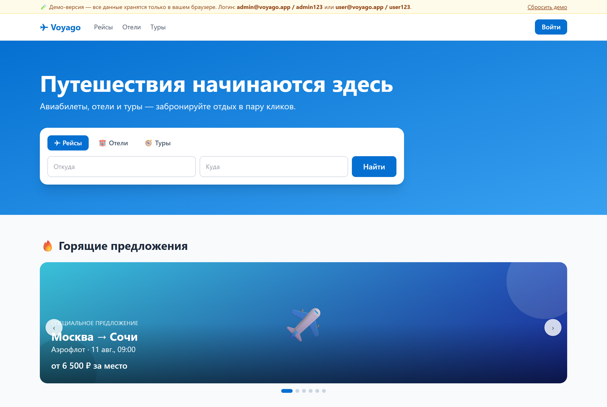
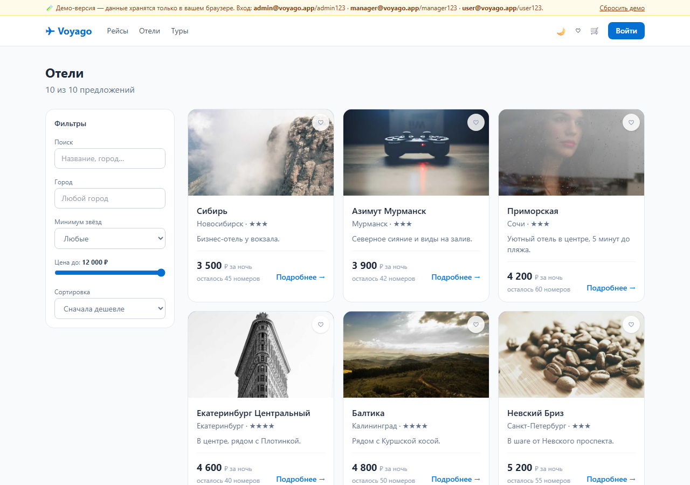
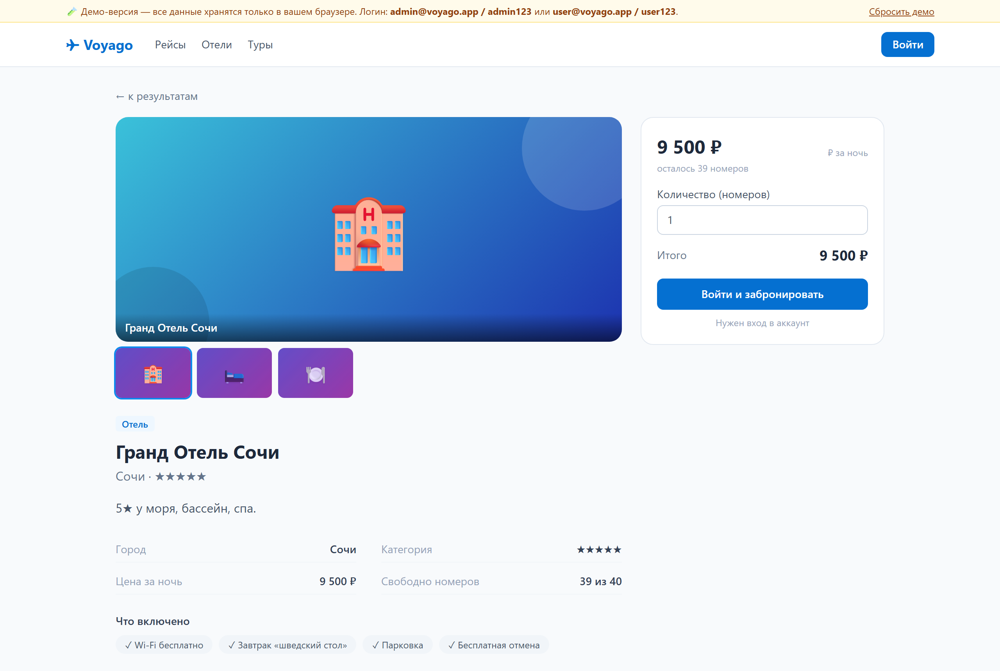
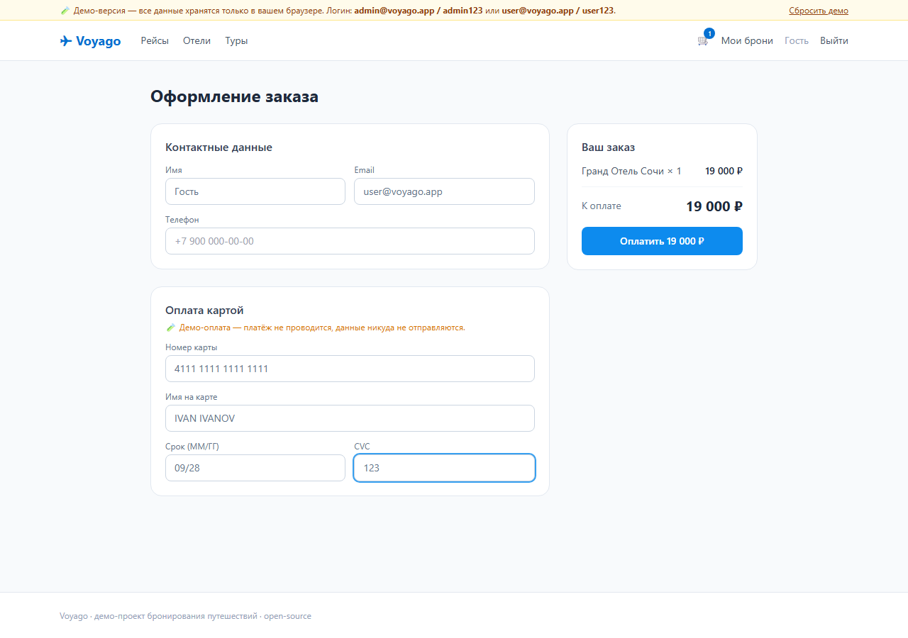

# ✈ Voyago — бронирование путешествий

### 🔴 [Открыть живое демо →](https://ant0haa.github.io/voyago/)

Кликабельная демо-версия в браузере — можно искать, бронировать, зайти как пользователь
или администратор. Данные хранятся локально в браузере (кнопка «Сбросить демо» вернёт всё
в исходное состояние). Полная версия с настоящим FastAPI-бэкендом — в каталоге `backend/`.

Учебно-демонстрационная платформа бронирования отдыха: **авиабилеты, отели и туры**.
Есть и **пользовательская** часть (поиск, бронирование, «Мои брони», авторизация),
и **административная** (дашборд, управление предложениями, все брони, статистика).

Проект с открытым кодом — можно клонировать, запустить локально и посмотреть,
как устроено небольшое, но полноценное full-stack-приложение с JWT-авторизацией,
ролями и честной бизнес-логикой мест/номеров.



## Возможности

**Для пользователя**
- Главная с каруселью «горящих предложений» и плиткой популярных направлений
- Каталог с **поиском, фильтрами** (город, дата, цена, звёзды, длительность,
  сортировка) и **пагинацией**; карточки с фотографиями
- **Страница предложения** с галереей, описанием, характеристиками и панелью бронирования
- **Корзина** и **оформление заказа**: выбор дат (для отелей — расчёт по ночам),
  количество, **данные путешественников**, контактные данные, **промокоды** и
  демо-оплата картой → подтверждение
- **Избранное** (сердечко на карточках, счётчик в шапке) и **отзывы с рейтингом**
  у отелей и туров
- **Тёмная тема** с сохранением выбора (и учётом системной темы)
- **Профиль** с информацией об аккаунте и **сменой пароля**
- Личный кабинет «Мои брони»: статусы (активна/завершена/отменена), фильтры, отмена
- Адаптивная вёрстка с мобильным меню-бургером, доступность (фокус, reduced-motion, ARIA)
- Регистрация и вход по email + паролю (JWT)

**Для сотрудников (RBAC)**
- **admin** — дашборд с выручкой, CRUD предложений (в т.ч. удаление), все брони
- **manager** — создание и редактирование предложений, все брони; удаление и
  выручка запрещены (проверяется и на бэкенде, и в UI)
- Таблица всех бронирований платформы; доступ к разделу — по роли

| Каталог с фильтрами | Страница предложения |
|---|---|
|  |  |

Оформление заказа (корзина → контактные данные → демо-оплата):



Обложки предложений (`Cover` в [frontend/src/media.tsx](frontend/src/media.tsx)) —
реальная фотография поверх тематического градиента с эмодзи; если фото не загрузилось,
остаётся градиент, поэтому вёрстка не ломается никогда.

Админку смотрите на [живом демо](https://ant0haa.github.io/voyago/): войдите как
`admin@voyago.app / admin123` (полный доступ) или `manager@voyago.app / manager123`
(менеджер — без удаления и выручки).

## Технологии

**Backend** — Python
- [FastAPI](https://fastapi.tiangolo.com/) — REST API
- [SQLModel](https://sqlmodel.tiangolo.com/) (SQLAlchemy + Pydantic) поверх SQLite
- JWT-авторизация (`python-jose`), хеширование паролей `bcrypt` (`passlib`)
- Тесты: `pytest` (21 тест, изолированная in-memory БД)

**Frontend** — TypeScript
- [React 18](https://react.dev/) + [Vite](https://vitejs.dev/)
- [React Router 6](https://reactrouter.com/), Context API для авторизации
- [Tailwind CSS](https://tailwindcss.com/)
- Тесты: [Vitest](https://vitest.dev/) + Testing Library (22 теста)

**CI** — GitHub Actions: прогон backend- и frontend-тестов + сборка на каждый push/PR.

## Архитектура

```
voyago/
├── backend/                 # FastAPI + SQLModel
│   ├── app/
│   │   ├── main.py          # приложение, CORS, старт БД и сидов
│   │   ├── db.py            # движок SQLite, сессии
│   │   ├── models.py        # таблицы: User, Flight, Hotel, Tour, Booking
│   │   ├── schemas.py       # DTO запросов/ответов
│   │   ├── auth.py          # JWT, хеширование, зависимости current_user / require_admin
│   │   ├── seed.py          # демо-данные при пустой БД
│   │   └── routers/         # auth, catalog, bookings, admin
│   └── tests/               # pytest
└── frontend/                # React + Vite + Tailwind
    ├── src/
    │   ├── api.ts           # типизированный клиент REST
    │   ├── auth.tsx         # AuthProvider / useAuth
    │   ├── App.tsx          # роутинг, навбар, защита маршрутов
    │   └── pages/           # Home, Catalog, MyBookings, AuthPage, Admin
    └── ...
```

Бизнес-логика мест: бронирование уменьшает остаток (`seats_left` / `rooms_left` /
`spots_left`), отмена — возвращает; при редактировании предложения администратором
уже проданные места сохраняются.

## Запуск

Нужны **Python 3.11+** и **Node.js 18+**.

### 1. Backend

```bash
cd backend
python -m venv .venv
# Windows: .venv\Scripts\activate   |   Linux/macOS: source .venv/bin/activate
pip install -r requirements.txt
uvicorn app.main:app --reload
```

API поднимется на `http://127.0.0.1:8000` (документация — `/docs`).
При первом старте создаётся `voyago.db` с демо-данными.

### 2. Frontend

```bash
cd frontend
npm install
npm run dev
```

Откройте `http://127.0.0.1:5173`. Vite проксирует `/api` на бэкенд, CORS настраивать не нужно.

### 3. Всё сразу через Docker

```bash
docker compose up --build
```

Поднимутся два контейнера: `backend` (FastAPI) и `frontend` (nginx со статикой +
прокси `/api` на бэкенд). Откройте `http://localhost:8080`. Данные SQLite хранятся в
именованном томе `backend_data`.

### Демо-доступы

| Роль | Email | Пароль |
|------|-------|--------|
| Администратор | `admin@voyago.app` | `admin123` |
| Менеджер | `manager@voyago.app` | `manager123` |
| Пользователь | `user@voyago.app` | `user123` |

> ⚠️ Демо-учётки и `SECRET_KEY` по умолчанию — только для локального запуска.
> Для продакшена задайте переменные окружения `SECRET_KEY` и смените пароли.

## Живое демо (GitHub Pages)

Демо на `https://ant0haa.github.io/voyago/` — это фронтенд, собранный в **демо-режиме**:
вместо сетевых запросов к бэкенду весь API работает прямо в браузере (данные в
`localStorage`, начальный каталог и пара броней предзаполнены). Так статический сайт
на GitHub Pages выглядит и ведёт себя как готовый продукт, без сервера.

Собрать демо-бандл локально:

```bash
cd frontend
VITE_DEMO=1 VITE_BASE=/voyago/ npm run build   # результат в frontend/dist
```

Публикацию выполняет GitHub Actions ([.github/workflows/pages.yml](.github/workflows/pages.yml))
на каждый push в `main`.

## Деплой бэкенда (Render)

В корне есть [render.yaml](render.yaml) (Blueprint). Чтобы поднять живой API:

1. [render.com](https://render.com) → **New** → **Blueprint** → выбрать этот репозиторий.
2. Render прочитает `render.yaml`, соберёт сервис `voyago-api` и сгенерирует `SECRET_KEY`.
3. После деплоя API доступен по адресу вида `https://voyago-api.onrender.com`
   (проверка — `/api/health`).

Чтобы фронтенд (например, на Pages/Netlify) ходил на этот API — соберите его с
`VITE_API_BASE=https://<ваш-домен>` и укажите этот домен в `CORS_ORIGINS` бэкенда.

## Тесты

```bash
# backend — pytest
cd backend && pytest -q

# frontend — юнит/компонентные (Vitest)
cd frontend && npm run test:run

# frontend — сквозные (Playwright, против демо-сборки)
cd frontend && npx playwright install chromium && npm run test:e2e
```

CI ([.github/workflows/ci.yml](.github/workflows/ci.yml)) на каждый push прогоняет
backend-тесты, frontend-тесты, E2E (Playwright) и сборку Docker-образов.

## Лицензия

[MIT](LICENSE) © 2026 Anton K.
